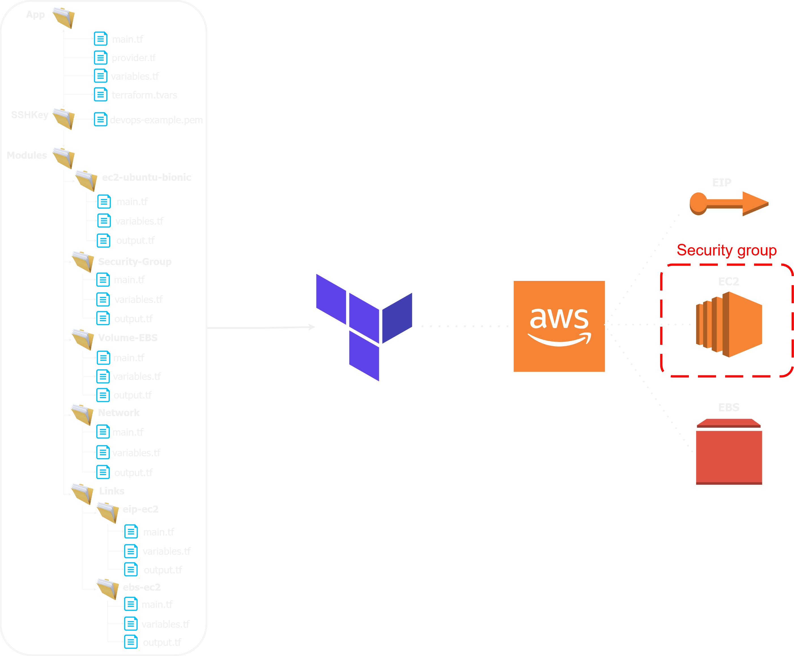

<div></div>
<div style="display: block; margin: auto"><h1 style="color: blue; text-align: center">Projet Groupe #1</h1>
<h3 style="text-align: center">Création d'une infrastructure complète avec Terraform</h3>
</div>

### pré-requis:
* Savoir récupérer un repository sur ***github***,
* Avoir des connaissances sur ***Terraform***,
* Avoir un compte ***AWS***,
* Avoir une paire de clés générée sur ***AWS***, 
* Avoir téléchargé le fichier `.pem` deppuis ***AWS***

### Introduction:
Ce projet a pour but de déployer une infrastructure dynamique complète à l'aide de ***Terraform***

### Téléchargement du projet : 
```gitexclude
git clone https://github.com/mtlaurent/mini-projet-groupe-1.git
```
### Création de l'arboresence :
Pour ce projet, nous avons créé les dossiers et fichiers suivants:

#### Ajout du fichier `.pem`
Ajouter votre clé ssh au format `.pem` dans le dossier `./ssh_key`
#### Affectations des valeurs aux variables
### Dans le dossier `./app` 
###### Authentification AWS
Ouvrir le fichier intitulé `variables.tf` dans ce fichier se trouve les variables :
* `acces_key` : entrer votre clé d'accès fournie par AWS
* `secret_key` : entrer votre clè secrete fourni par AWS
* `région` : entrer la région de votre choix

Ouvrir le fichier intitulé `main.tf`, dans ce fichier, se trouvent les variables : 
* `ssh_key` : entrer le chemin de la clés ssh, `../ssh_key/nom_de_votre_clé.pem`
* `key_name` : entrer le nom de votre clé AWS exemple `devops-example`

###### Configuration dans le fichier `main.tf`
Dans la section `module "ec2module"`, les variables suivantes permettent la personnalisation de l'instance.
* `instance_type` : permet d'indiquer le type d'instance.
* `tag_name` : permet d'indiquer le nom de l'instance.
* `security_group_id` : permet d'indiquer à quel groupe de sécurité affecter l'instance. 

Dans la section `module "link_eip_to_ec2"`, les variables suivantes permettent la personnalisation de l'elastic IP.
* `aws_instance_id` : permet d'indiquer à quel instance affecter l'eip.
* `eip_allocation_id` : Permet d'indiquer l'`eip ID` à affecter à l'instance.

Dans la section `module "volume_ebs"`, les variables suivantes permettent la personnalisation du volume ebs.
* `ebs_size` : permet d'inquer la taille du volume.
* `ebs_region` : permer d'indiquer la zone de disponibilité du volume

### Lancement du script ***Terraform***

Se placer dans le dossier `./app`, lancer les commandes `terraform init`, `terraform plan`, puis `terraform apply`.
Une fois le script terminé, vous trouverez dans le fichier `./app/ip_ec2-project.txt` l'adresse IP public de l'instance.